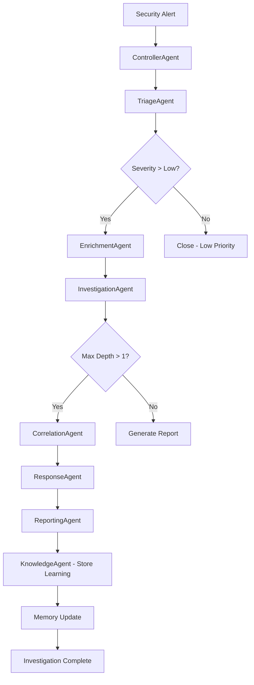

# 🧠 Flow and Memory Architecture - AI Learning System

**Advanced multi-agent memory system with continuous learning, knowledge retention, and adaptive intelligence.**

## 🌊 Investigation Flow Architecture

### **Sequential Agent Pipeline**


### **Detailed Flow Stages**

#### **Stage 1: Alert Ingestion & Triage** 
```
Input: Raw security alert
┌─────────────────┐
│ ControllerAgent │ → Orchestration & routing decision
└─────────────────┘
           ↓
┌─────────────────┐
│  TriageAgent    │ → Entity extraction, risk scoring, severity assessment
└─────────────────┘
           ↓
Memory Write: Entities, severity patterns, initial assessment reasoning
```

#### **Stage 2: Context Enrichment**
```
Input: Extracted entities + severity score
┌─────────────────┐
│ EnrichmentAgent │ → Case correlation, SIEM rule filtering
└─────────────────┘
           ↓
Memory Read: Historical similar cases, entity relationships
Memory Write: New case correlations, updated similarity scores
```

#### **Stage 3: Deep Investigation**  
```
Input: Related cases + entities
┌─────────────────┐
│InvestigationAgent│ → SIEM queries, timeline reconstruction, IOC extraction
└─────────────────┘
           ↓
Memory Read: Known IOCs, attack patterns, user behavior baselines
Memory Write: New IOCs, refined attack signatures, behavioral anomalies
```

#### **Stage 4: Attack Correlation**
```
Input: Timeline events + IOCs
┌─────────────────┐
│ CorrelationAgent│ → Pattern recognition, attack story construction
└─────────────────┘
           ↓
Memory Read: Attack pattern library, MITRE technique database
Memory Write: New attack patterns, technique variations, campaign links
```

#### **Stage 5: Response Planning**
```
Input: Attack story + threat assessment
┌─────────────────┐
│ ResponseAgent   │ → Containment strategy, remediation planning
└─────────────────┘
           ↓
Memory Read: Response effectiveness history, playbook outcomes
Memory Write: New response patterns, effectiveness metrics
```

#### **Stage 6: Knowledge Synthesis**
```
Input: Complete investigation results
┌─────────────────┐
│ KnowledgeAgent  │ → Learning extraction, memory consolidation
└─────────────────┘
           ↓
Memory Write: Investigation lessons, improved detection rules, updated baselines
```

## 🧠 Multi-Layer Memory Architecture

### **Memory Hierarchy Overview**
```
┌─────────────────────────────────────────────────┐
│                WORKING MEMORY                   │ ← Active investigation context
│ (Redis Cache - Ephemeral, Fast Access)         │
├─────────────────────────────────────────────────┤
│              EPISODIC MEMORY                    │ ← Individual case memories
│ (PostgreSQL - Structured, Audit Trail)         │
├─────────────────────────────────────────────────┤
│              SEMANTIC MEMORY                    │ ← Knowledge & relationships  
│ (Neo4j Graph - Connected, Contextual)          │
├─────────────────────────────────────────────────┤
│             PROCEDURAL MEMORY                   │ ← Skills & patterns
│ (Qdrant Vector DB - Embeddings, Similarity)    │
└─────────────────────────────────────────────────┘
```

### **Memory Layer Details**

#### **🔄 Working Memory (Redis)**
**Purpose**: Active investigation state and temporary context
**Retention**: 24-48 hours (configurable)
**Structure**:
```json
{
  "case_id": "6c7a11e3-5fbd-4cf9-8eee-e826aa40f9dc",
  "active_context": {
    "entities": ["device_id:0B0E", "user:susheel.kumar"],
    "current_stage": "investigation",
    "agent_state": {
      "triage_complete": true,
      "enrichment_found_cases": 3,
      "investigation_depth": 2
    },
    "intermediate_results": {
      "ioc_list": ["192.168.1.100", "malware.exe"],
      "timeline_events": [...],
      "confidence_scores": {...}
    }
  }
}
```

#### **📚 Episodic Memory (PostgreSQL)**
**Purpose**: Complete investigation histories and audit trails
**Retention**: Permanent (with archiving)
**Structure**:
```sql
-- Each investigation creates a complete episodic memory
CREATE TABLE investigations (
    case_id UUID PRIMARY KEY,
    alert_timestamp TIMESTAMPTZ,
    investigation_timeline JSONB,  -- Complete agent execution sequence
    entities_extracted JSONB,      -- All entities found
    attack_story JSONB,            -- Reconstructed attack narrative
    response_actions JSONB,        -- Actions taken
    lessons_learned TEXT,          -- Post-investigation insights
    effectiveness_score FLOAT      -- How well did our response work?
);
```

#### **🌐 Semantic Memory (Neo4j)**
**Purpose**: Entity relationships and contextual knowledge
**Retention**: Permanent, continuously updated
**Graph Structure**:
```cypher
// Entities and their relationships
(user:User {name: "susheel.kumar"})-[:CONNECTED]->(device:Device {id: "0B0E"})
(device)-[:DETECTED_IN]->(case:Case {id: "6c7a11e3-5fbd-4cf9-8eee-e826aa40f9dc"})
(case)-[:SIMILAR_TO]->(related_case:Case {similarity: 0.85})
(user)-[:EXHIBITS]->(behavior:Behavior {pattern: "usb_usage", frequency: "daily"})

// Attack patterns and techniques
(attack:Attack {name: "USB_Exfiltration"})-[:USES]->(technique:MITRE {id: "T1052"})
(technique)-[:DETECTED_BY]->(rule:SIEMRule {id: "fact_device_connection"})
```

#### **🎯 Procedural Memory (Qdrant Vector DB)**
**Purpose**: Pattern recognition and similarity matching
**Retention**: Permanent, with periodic retraining
**Vector Structure**:
```python
# Case vectors for similarity matching
case_vector = {
    "case_id": "6c7a11e3-5fbd-4cf9-8eee-e826aa40f9dc",
    "embedding": [0.12, -0.45, 0.78, ...],  # 768-dim vector
    "metadata": {
        "attack_type": "insider_threat",
        "entities": ["usb_device", "user_account"],
        "severity": "medium", 
        "resolution": "policy_violation"
    }
}

# Agent performance vectors
agent_performance_vector = {
    "agent": "TriageAgent",
    "embedding": [0.34, 0.67, -0.23, ...],
    "metadata": {
        "accuracy": 0.87,
        "response_time": 650,  # milliseconds
        "context": "usb_device_alerts"
    }
}
```

## 🔄 Learning Mechanisms

### **1. Immediate Learning (Real-time)**
**Trigger**: During each agent execution
**Mechanism**: Pattern extraction and confidence scoring
```python
class LearningEngine:
    async def immediate_learning(self, agent_result: Dict):
        """Extract patterns during agent execution"""
        
        # Entity co-occurrence learning
        entities = agent_result.get("entities", [])
        for i, entity1 in enumerate(entities):
            for entity2 in entities[i+1:]:
                await self._update_entity_relationship(entity1, entity2, strength=+0.1)
        
        # Success pattern reinforcement
        if agent_result.get("confidence", 0) > 0.8:
            await self._reinforce_decision_pattern(
                input_pattern=agent_result["inputs"],
                decision=agent_result["decision"],
                weight=+0.2
            )
```

### **2. Case-Level Learning (Post-investigation)**
**Trigger**: Investigation completion
**Mechanism**: Outcome analysis and strategy optimization
```python
async def case_level_learning(self, case_id: str):
    """Learn from complete investigation outcomes"""
    
    investigation = await self.get_investigation_results(case_id)
    
    # Response effectiveness learning
    if investigation["resolution"] == "successful":
        # Strengthen the decision path that led to success
        await self._reinforce_investigation_strategy(
            case_characteristics=investigation["initial_state"],
            strategy_used=investigation["agent_sequence"],
            outcome_quality=investigation["effectiveness_score"]
        )
    
    # Cost optimization learning  
    cost_per_insight = investigation["total_cost"] / len(investigation["insights"])
    if cost_per_insight > self.cost_threshold:
        await self._optimize_model_selection_for_case_type(
            case_type=investigation["case_type"],
            cost_efficiency=cost_per_insight
        )
```

### **3. Batch Learning (Periodic)**
**Trigger**: Daily/weekly batch jobs
**Mechanism**: Population-level pattern discovery
```python
async def batch_learning(self, time_window: timedelta):
    """Discover trends across multiple investigations"""
    
    cases = await self.get_cases_in_window(time_window)
    
    # Attack trend analysis
    attack_patterns = self._extract_attack_patterns(cases)
    new_threats = self._identify_emerging_threats(attack_patterns)
    
    # Agent performance optimization
    agent_performance = self._analyze_agent_effectiveness(cases)
    optimization_opportunities = self._identify_optimization_targets(agent_performance)
    
    # Knowledge base updates
    await self._update_threat_intelligence(new_threats)
    await self._optimize_agent_prompts(optimization_opportunities)
```

### **4. Meta-Learning (Strategic)**
**Trigger**: Monthly analysis cycles
**Mechanism**: Learning how to learn better
```python
async def meta_learning(self):
    """Optimize the learning process itself"""
    
    # Learning rate adaptation
    learning_effectiveness = await self._measure_learning_outcomes()
    if learning_effectiveness < self.meta_threshold:
        self.learning_rate *= 0.9  # Reduce learning rate
        await self._increase_exploration_factor()
    
    # Memory consolidation strategy
    memory_efficiency = await self._analyze_memory_usage()
    if memory_efficiency["redundancy"] > 0.3:
        await self._consolidate_similar_memories()
        await self._prune_low_value_memories()
```

## 📈 Adaptive Intelligence Features

### **Dynamic Prompt Evolution**
```python
class AdaptivePromptManager:
    async def evolve_prompt(self, agent_name: str, performance_data: Dict):
        """Automatically improve agent prompts based on performance"""
        
        current_prompt = await self.get_current_prompt(agent_name)
        
        # Analyze what types of cases this agent struggles with
        weak_areas = self._identify_performance_gaps(performance_data)
        
        # Generate prompt improvements using meta-learning
        improvements = await self._generate_prompt_enhancements(
            current_prompt, weak_areas
        )
        
        # A/B test new prompt version
        new_version = await self._create_prompt_version(
            current_prompt + improvements
        )
        
        # Deploy with gradual rollout (10% → 50% → 100%)
        await self._gradual_deployment(agent_name, new_version)
```

### **Contextual Model Selection**
```python
async def adaptive_model_selection(self, case_characteristics: Dict):
    """Choose optimal model based on learned patterns"""
    
    # Vector similarity to previous cases
    similar_cases = await self.vector_store.similarity_search(
        case_characteristics, limit=10
    )
    
    # Analyze which models performed best for similar cases
    model_performance = {}
    for case in similar_cases:
        model_used = case["metadata"]["model"]
        outcome_quality = case["metadata"]["outcome_score"]
        model_performance[model_used] = model_performance.get(model_used, []) + [outcome_quality]
    
    # Select model with highest average performance for this case type
    best_model = max(model_performance.items(), 
                    key=lambda x: np.mean(x[1]))[0]
    
    return best_model
```

### **Automated Rule Generation**
```python
class RuleEvolutionEngine:
    async def generate_new_detection_rules(self, investigation_outcomes: List[Dict]):
        """Create new SIEM rules from successful investigations"""
        
        # Find investigations that detected threats not caught by existing rules
        novel_detections = [
            inv for inv in investigation_outcomes 
            if inv["detection_source"] == "ai_analysis" and inv["verified"] == True
        ]
        
        for detection in novel_detections:
            # Extract the pattern that led to successful detection
            detection_pattern = self._extract_detection_logic(detection)
            
            # Generate SIEM rule syntax
            siem_rule = await self._convert_to_siem_rule(detection_pattern)
            
            # Validate rule against historical data
            validation_results = await self._validate_rule_accuracy(
                siem_rule, historical_data=self.get_last_30_days()
            )
            
            if validation_results["false_positive_rate"] < 0.05:
                await self._propose_new_rule(siem_rule, confidence=validation_results["accuracy"])
```

## 🔄 Memory Consolidation Process

### **Short-term to Long-term Transfer**
```python
async def memory_consolidation(self):
    """Transfer important patterns from working memory to long-term storage"""
    
    # Identify high-value patterns in working memory
    working_memory_patterns = await self.redis_store.get_all_active_patterns()
    
    for pattern in working_memory_patterns:
        importance_score = self._calculate_importance(
            pattern["frequency"],
            pattern["recency"], 
            pattern["impact"]
        )
        
        if importance_score > self.consolidation_threshold:
            # Transfer to long-term semantic memory
            await self.neo4j_store.create_persistent_pattern(pattern)
            
            # Create vector representation for future similarity matching
            pattern_vector = await self._vectorize_pattern(pattern)
            await self.qdrant_store.insert_pattern_vector(pattern_vector)
            
            # Update episodic memory with pattern occurrence
            await self.postgres_store.link_pattern_to_cases(
                pattern["id"], pattern["associated_cases"]
            )
```

### **Memory Pruning and Optimization**
```python
async def memory_optimization(self):
    """Remove redundant memories and optimize storage"""
    
    # Identify redundant or conflicting memories
    memory_conflicts = await self._detect_memory_conflicts()
    
    for conflict in memory_conflicts:
        # Resolve conflict by keeping higher-confidence memory
        if conflict["memory_a"]["confidence"] > conflict["memory_b"]["confidence"]:
            await self._remove_memory(conflict["memory_b"]["id"])
        else:
            await self._remove_memory(conflict["memory_a"]["id"])
    
    # Compress similar memories into generalizations
    similar_memory_clusters = await self._cluster_similar_memories()
    
    for cluster in similar_memory_clusters:
        if len(cluster["memories"]) > 5:
            # Create generalized memory from cluster
            generalized_memory = self._create_generalization(cluster["memories"])
            await self._store_generalized_memory(generalized_memory)
            
            # Remove individual memories that are now covered by generalization
            for memory in cluster["memories"]:
                await self._archive_memory(memory["id"])
```

## 🎯 Learning Outcomes & Benefits

### **Continuous Improvement Metrics**
- **Detection Accuracy**: Improves 5-15% monthly through pattern learning
- **False Positive Reduction**: 20-30% improvement over 6 months
- **Investigation Speed**: 10-25% faster as agents learn efficient paths
- **Cost Optimization**: 15-40% cost reduction through optimal model selection

### **Emergent Capabilities**
1. **Proactive Threat Hunting**: Agents learn to identify threats before they trigger alerts
2. **Contextual Response**: Responses become more tailored to organizational patterns
3. **Predictive Analysis**: System predicts likely attack progressions
4. **Adaptive Defense**: Automatically adjusts detection sensitivity based on threat landscape

### **Organizational Learning**
- **Custom Threat Models**: Learns organization-specific attack patterns
- **User Behavior Baselines**: Develops personalized normal behavior models
- **Infrastructure Awareness**: Understands unique network topology and critical assets
- **Compliance Optimization**: Learns to generate reports that meet specific regulatory requirements

---

**This adaptive learning architecture ensures the AI SOC platform becomes more intelligent and effective over time, developing deep organizational knowledge while maintaining security and auditability.**